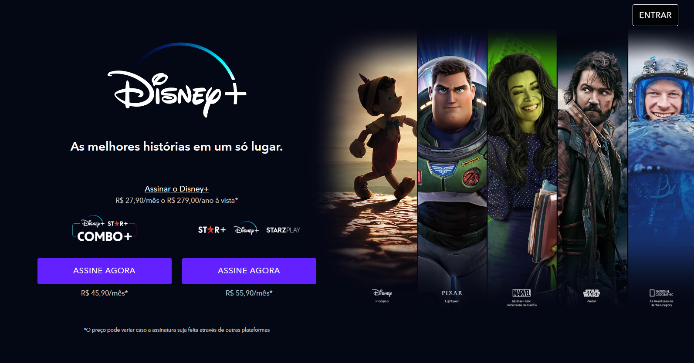
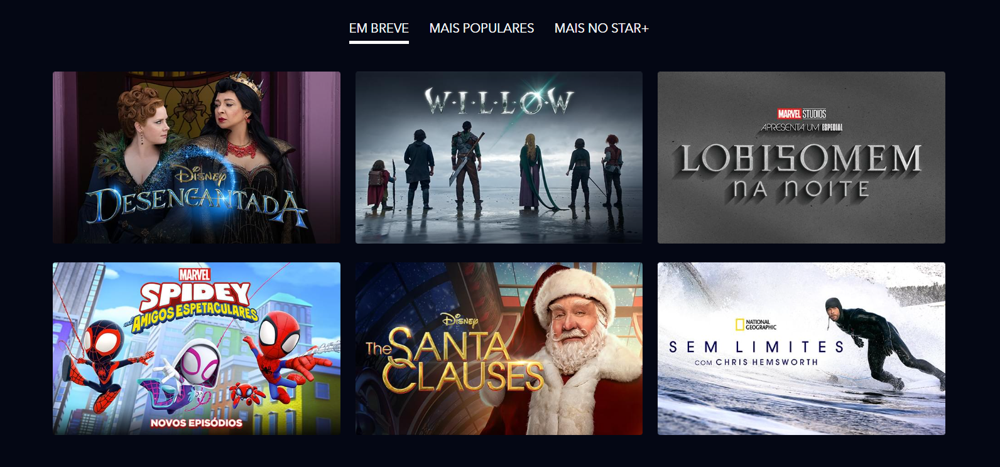
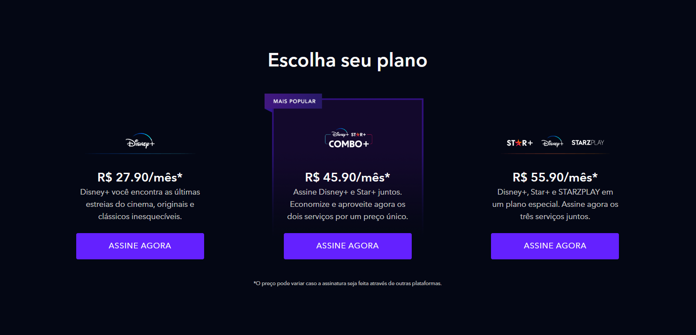
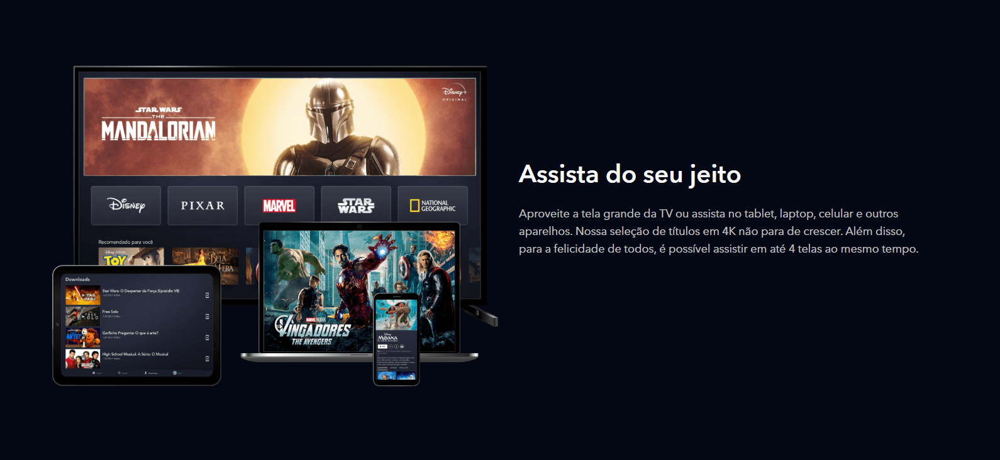
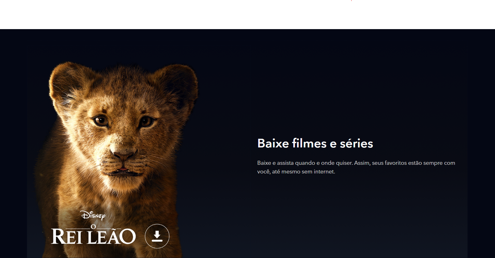
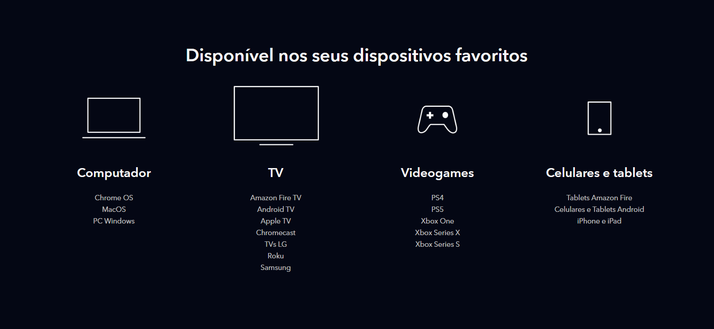
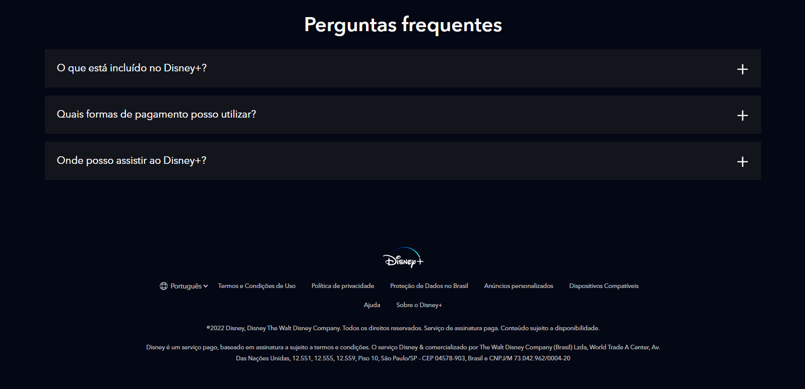

# Clone DisneyPlus

Este é um projeto de um clone da interface do Disney+, desenvolvido com HTML, SCSS e JavaScript. O objetivo é recriar a experiência visual e funcional do site oficial do Disney+.

---

## 📌 Funcionalidades

- **Interface Responsiva**
  - Design adaptável para diferentes dispositivos e resoluções de tela.
  - Seções como "Hero", "Shows", "Planos", "Dispositivos Compatíveis" e "FAQ".
  - Navegação por abas para exibir diferentes categorias de conteúdo.

- **Estilização Avançada**
  - Uso de SCSS para modularização e reutilização de estilos.
  - Variáveis e mixins para facilitar manutenção e consistência visual.
  - Fontes personalizadas e imagens otimizadas.

- **Interatividade com JavaScript**
  - Manipulação do DOM para interações dinâmicas.
  - Expansão de perguntas frequentes (FAQ).
  - Animações e efeitos visuais sutis.

- **Automatização com Gulp**
  - Compilação automática de SCSS para CSS.
  - Minificação e otimização de arquivos.
  
---

## 🚀 Tecnologias Utilizadas

- **HTML5**: Estrutura semântica do projeto.
- **SCSS**: Estilização modularizada.
- **JavaScript (ES6+)**: Lógica de interatividade.
- **Gulp**: Automatização de tarefas.
- **Node.js & npm**: Gerenciamento de dependências.

---

## 🛠 Como Executar o Projeto

### 1️⃣ **Pré-requisitos**
- Ter o [Node.js](https://nodejs.org/) instalado.
- Gerenciador de pacotes `npm` configurado.

### 2️⃣ **Instalar Dependências**
```bash
npm install
```

### 3️⃣ **Rodar o Projeto em Desenvolvimento**
```bash
npm run dev
```

### 4️⃣ **Gerar Build para Produção**
```bash
npm run build
```

### 5️⃣ **Abrir no Navegador**
Basta abrir o arquivo `index.html` no navegador para visualizar o projeto.

---

## 📂 Estrutura do Projeto

```
.
├── index.html
├── dist/
│   ├── css/
│   ├── images/
│   └── js/
├── src/
│   ├── styles/
│   │   ├── _variaveis.scss
│   │   ├── _header.scss
│   │   ├── _hero.scss
│   │   ├── _planos.scss
│   │   ├── _faq.scss
│   │   └── main.scss
│   ├── scripts/
│   ├── images/
├── README.md
└── package.json
```

---

## 🎨 Galeria de Imagens e Vídeo

### 📷 Imagens do Projeto

- **Página Inicial**
  
- **Segunda Seção**
  
- **Terceira Seção**
  
- **Quarta Seção**
  
- **Quinta Seção**
  
- **Sexta Seção**
  
- **Sétima Seção**
  

### 🎥 Vídeo Demonstrativo
[Assista ao vídeo do projeto](./mídia/video-projeto.mp4)

---

## 📜 Licença

Este projeto foi criado apenas para fins educacionais e não possui qualquer afiliação com a Disney. Todos os direitos sobre o conteúdo visual e textual pertencem à Disney.

